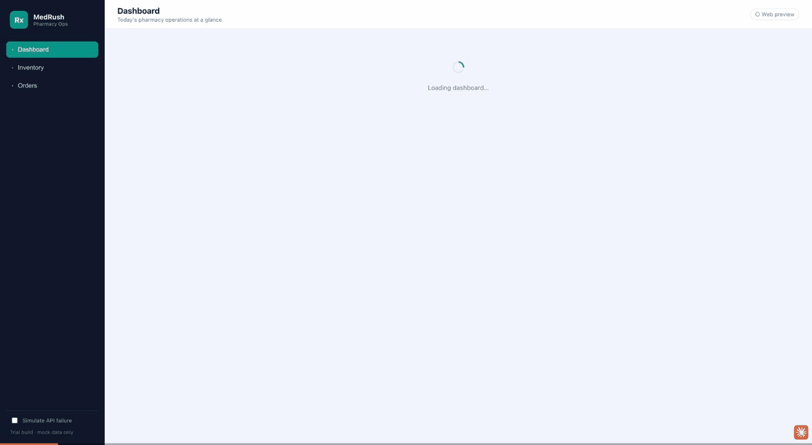
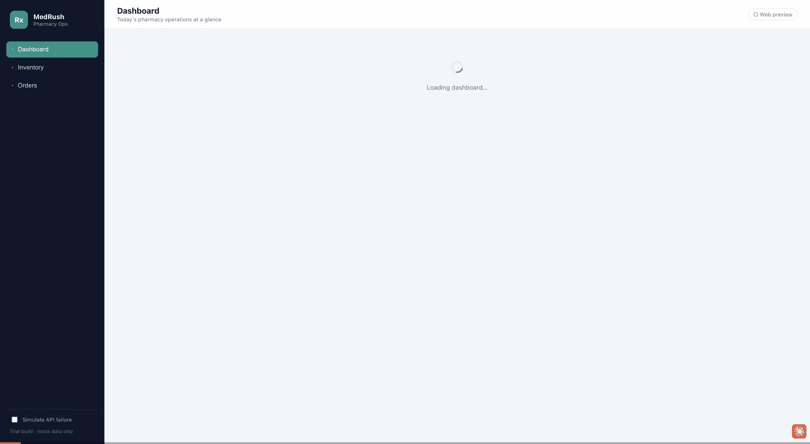

# MedRush Pharmacy — Desktop Mini-Dashboard

An installed **desktop** pharmacy operations app built with **Electron + React + TypeScript** (Vite via `electron-vite`). It runs as a real desktop window with a sidebar, top bar, data tables, modals, and a printable invoice — not just a web page.

> Trial task submission. All data is mock/fictional. No real patient data, prescriptions, or credentials are used.

---

## ✨ Features

**Dashboard**
- KPI cards: **orders today**, **pending orders**, **sales today**, **low-stock count**
- Low-stock alerts panel + pending-orders panel (click a pending order to open it)

**Inventory**
- Table: medicine name, quantity, price, batch number, expiry date, availability status
- **Add** medicine (validated modal form)
- **Edit** medicine (same reusable form, prefilled)
- **Low-stock highlighting** based on a per-item threshold (row highlight + status badge)
- Expiry warnings (expired / expiring within 60 days)
- Search by name or batch
- **CSV import with preview** (validates each row, shows valid vs skipped before committing)

**Orders**
- Order list with status filters (pending / accepted / preparing / delivered / rejected) and counts
- **Order detail** view with **Accept / Reject / Mark Preparing / Mark Delivered** actions
- Status transitions are guarded in the data layer (illegal jumps are rejected)

**Invoice / Receipt**
- Printable receipt preview with subtotal, tax, and total
- **Print** action (native Electron print pipeline; browser dialog fallback)
- **Download** placeholder (emits a `.txt` receipt)

**Cross-cutting**
- **Loading, empty, and error states** everywhere data is fetched
- Reusable `DataTable`, `StatusBadge`, `Modal`, `StatCard`, and state-view components
- Typed domain models shared across the mock API, hooks, and UI — no data shapes inlined in JSX
- "Simulate API failure" toggle (sidebar) to demo the error state end-to-end

---

## 🖥️ Desktop-specific features

The renderer runs **sandboxed** (`sandbox: true`, `contextIsolation: true`, `nodeIntegration: false`). All privileged work crosses a small, typed IPC bridge exposed as `window.api` in `src/preload/index.ts`:

| Bridge method | Main handler | What it does |
|---|---|---|
| `getAppInfo()` | `app:info` | Returns Electron/Node versions + platform (shown in the top-bar "Desktop" badge) |
| `importInventoryCsv()` | `inventory:importCsv` | Opens a **native file dialog**, reads the CSV in the main process, returns its text |
| `printInvoice()` | `invoice:print` | Prints the current view via Electron's print pipeline |

The renderer never touches the filesystem or `ipcRenderer` directly. `src/renderer/src/api/desktop.ts` wraps the bridge and provides browser fallbacks so the UI also runs under a plain browser during development.

---

## 🧱 Tech stack & architecture

- **Electron 33**, **React 18**, **TypeScript 5**, **Vite 5** (`electron-vite`)
- No UI framework dependency — hand-written CSS for a lean, explainable build

```
src/
  main/index.ts          # Electron main process + IPC handlers (dialog, print, app info)
  preload/index.ts       # Typed contextBridge → window.api (the only main↔renderer surface)
  preload/index.d.ts     # Global Window.api typing for the renderer
  renderer/
    index.html
    src/
      main.tsx           # React entry
      App.tsx            # Shell + typed state-based router
      routes.ts          # Route union + nav config
      types.ts           # Shared domain models (Medicine, Order, …)
      api/
        seed.ts          # Fictional seed data (kept out of JSX)
        mockApi.ts       # Async in-memory data layer (latency, errors, transition rules)
        csv.ts           # Dependency-free CSV parser + per-row validation
        desktop.ts       # window.api wrapper with browser fallbacks
      hooks/useAsync.ts  # loading / error / reload primitive with stale-result guarding
      components/        # DataTable, StatusBadge, Modal, StatCard, StateViews, forms…
      pages/             # Dashboard, Inventory, Orders, OrderDetail, Invoice
      utils/format.ts    # currency/date helpers
      styles/index.css   # Desktop dashboard theme + print styles
```

**Why a hand-rolled router?** Five screens with typed navigation don't need `react-router`; a discriminated-union `Route` in `App` state keeps it fully typed and trivially explainable.

**Why a mock API module?** Every component is written against async functions returning promises. Swapping `mockApi.ts` for real `fetch()` calls would not change a single component.

---

## 🚀 Getting started

Requires **Node 18+** (developed on Node 24).

```bash
npm install

# Run the desktop app in dev (hot-reloaded renderer inside an Electron window)
npm run dev

# Type-check the whole project (node + web configs)
npm run typecheck

# Production build (main + preload + renderer → out/)
npm run build

# Launch the production build in Electron
npm run preview
```

### Try the flows
1. **Dashboard** → see KPIs; click a pending order to jump to its detail.
2. **Inventory** → *Add medicine*, *Edit* a row, or *Import CSV* using the bundled `sample-inventory.csv` (it includes one deliberately invalid row to show validation).
3. **Orders** → open an order → *Accept* → *Mark Preparing* → *Mark Delivered* → *View invoice* → *Print*.
4. Flip **"Simulate API failure"** in the sidebar, then navigate — every screen shows its error state with a working **Retry**.

---

## 📦 Packaging for Windows

Packaging is configured with `electron-builder` (`electron-builder.yml`) targeting **NSIS installer** + **portable** exe.

```bash
# Unpacked build (fast smoke test, no installer)
npm run pack:win

# Full Windows installer + portable exe → dist/
npm run dist:win
```

Run these on Windows (or via CI/Wine) to produce Windows artifacts. On macOS/Linux the same tool can build `dmg`/`AppImage` for local testing. Output lands in `dist/`.

> No code-signing certificate is configured — installers are unsigned (fine for a trial build).

---

## 🧪 Assumptions

- **Online-first**, single-session, in-memory data. State resets on relaunch (no persistence layer — offline sync was explicitly out of scope for the trial).
- Currency is USD; tax on the invoice is a flat demo 5%.
- "Sales today" = total of **delivered** orders created today.
- Low-stock = quantity `≤` the item's `lowStockThreshold`; out-of-stock = quantity `0`.
- Order status transitions: `pending → accepted → preparing → delivered`, with `pending → rejected` and a permitted `accepted → delivered` shortcut.

## ⚠️ Limitations

- Data is mock only; no backend, database, or auth.
- Invoice "Download" is a placeholder (plain-text `.txt`, not a formatted PDF).
- CSV import expects the header `name,quantity,price,batchNumber,expiryDate,lowStockThreshold` (case-insensitive); it handles simple quoted fields but is not a full RFC-4180 parser.
- Windows installers are unsigned; no auto-update channel.
- No automated test suite (manual verification via the flows above).

## 📸 Demo

**Dashboard → Inventory** (KPI cards, low-stock highlighting, expiry warnings):



**Order workflow end-to-end** (open order → Accept → Mark Preparing → Mark Delivered → printable invoice → error state):



> GIFs recorded against the browser preview (`npm run dev:web`); the packaged Electron build renders identically with the native print dialog and file-picker. A voiced 3–6 min Loom (candidate explaining the code) is still required per the submission rules.

---

## 📂 Scripts

| Script | Purpose |
|---|---|
| `npm run dev` | Electron + hot-reloaded renderer |
| `npm run build` | Build main/preload/renderer to `out/` |
| `npm run preview` | Run the built app in Electron |
| `npm run typecheck` | `tsc --noEmit` for node + web configs |
| `npm run pack:win` | Unpacked Windows build |
| `npm run dist:win` | Windows installer + portable |
